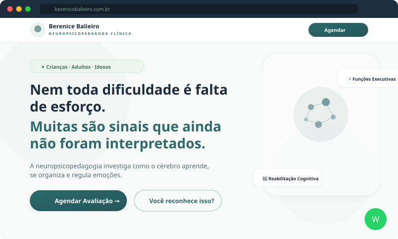

<div align="center">

# 🧠 Berenice Balieiro — Clinical Neuropsychopedagogue

**High-conversion landing page for neuropsychopedagogical assessment and cognitive rehabilitation — children, adults & elderly.**

[](https://nextjs.org/)
[](https://react.dev/)
[](https://typescriptlang.org/)
[](https://tailwindcss.com/)
[](https://vercel.com/)
[](#)
[](#license)

</div>

---

## 🎬 Demo

<div align="center">
  
  <br/>
  <em>Animated preview — auto-scrolls through Hero, Pain Points, Belief Break, Science and CTA sections</em>
</div>

---

## ✨ Features

| Feature | Description |
|---------|-------------|
| **12-Section High-Conversion Page** | Hero, pain identification, belief break, science explainer, about, process, audience tabs, differentials, trust, CTA |
| **3 Target Audiences** | Interactive tabbed sections for children, adults, and elderly |
| **WhatsApp Integration** | Floating button + CTA buttons with pre-filled message (pre-configured) |
| **Scroll Animations** | Intersection Observer-powered fade-in reveals on each section |
| **Favicon & Branding** | Custom neural brain logo as favicon in multiple sizes |
| **Responsive Design** | Mobile-first approach, optimized for all screen sizes |
| **SEO Optimized** | Meta tags, Open Graph, favicon, semantic HTML |
| **Performance** | Static generation, zero vulnerabilities, optimized bundle |
| **Clinical Color Palette** | Teal/sage/sand tones — industry standard for health & neuroscience |
| **Copywriting Strategy** | Authority-based clinical copy, belief-breaking, trust signals |

---

## 🛠 Tech Stack

- **Framework:** [Next.js 16](https://nextjs.org/) (App Router)
- **UI Library:** [React 19](https://react.dev/)
- **Language:** [TypeScript 5](https://typescriptlang.org/)
- **Styling:** [Tailwind CSS 3](https://tailwindcss.com/)
- **Icons:** [Lucide React](https://lucide.dev/)
- **Font:** [Plus Jakarta Sans](https://fonts.google.com/specimen/Plus+Jakarta+Sans) (sans-serif)
- **Hosting:** [Vercel](https://vercel.com/) (free tier)

---

## 🎨 Design System

| Token | Value | Usage |
|-------|-------|-------|
| Primary | `#2d6a6c` | Teal — buttons, headings, CTAs |
| Accent | `#7ca28b` | Sage green — icons, badges |
| Warm | `#f4efe8` | Sand — warm background sections |
| Background | `#f8faf9` | Off-white green — page background |
| Text | `#1e2d3d` | Navy — body text |
| Font | Plus Jakarta Sans | Headings & body (sans-serif) |

---

## 🚀 Quick Start

### Prerequisites
- [Node.js](https://nodejs.org/) 18+

### Local Development

```bash
git clone https://github.com/fredericoahb/neuropsicopedagoga-berenice-balieiro.git
cd neuropsicopedagoga-berenice-balieiro
npm install
npm run dev
```

Open [http://localhost:3000](http://localhost:3000).

---

## 📁 Project Structure

```
neuropsicopedagoga-berenice-balieiro/
├── docs/
│   └── demo.svg                # Animated SVG preview for README
├── public/
│   ├── logo.jpg                # Neural brain network logo
│   ├── berenice.jpg            # Professional profile photo
│   ├── favicon-16.png          # Favicon 16x16
│   ├── favicon-32.png          # Favicon 32x32
│   ├── apple-touch-icon.png    # Apple Touch Icon 180x180
│   ├── icon-192.png            # PWA icon 192x192
│   └── icon-512.png            # PWA icon 512x512
├── src/app/
│   ├── globals.css             # Tailwind + clinical color palette + animations
│   ├── layout.tsx              # SEO metadata + favicon config
│   └── page.tsx                # Full 12-section high-conversion landing page
├── next.config.js
├── package.json
├── postcss.config.js
├── tailwind.config.js
├── tsconfig.json
└── vercel.json
```

---

## 🌐 Deploy

### Vercel (recommended)

Push to GitHub, then import at [vercel.com/new](https://vercel.com/new). Next.js is auto-detected.

```bash
# Or via CLI:
npm i -g vercel && vercel --prod
```

### Custom Domain (.com.br)

After deploying, register your domain at [Registro.br](https://registro.br) and configure DNS:

| Type | Name | Value |
|------|------|-------|
| `A` | `@` | `76.76.21.21` |
| `CNAME` | `www` | `cname.vercel-dns.com` |

---

## 📄 License

[MIT License](LICENSE)

<div align="center">

**Built with evidence-based strategy for families seeking answers.**

</div>
