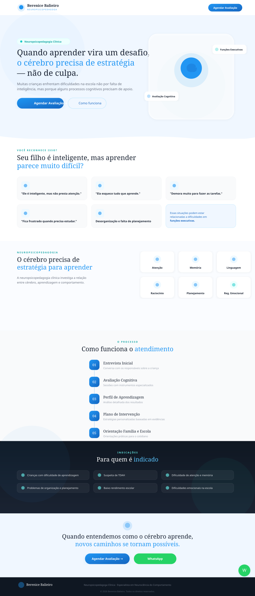

<div align="center">

# 🧠 Berenice Balieiro — Clinical Neuropsychopedagogue

**Professional landing page for neuropsychopedagogical assessment and cognitive rehabilitation services.**

[](https://nextjs.org/)
[](https://typescriptlang.org/)
[](https://tailwindcss.com/)
[](https://vercel.com/)
[](#license)

</div>

---

## 📸 Preview

<div align="center">
  
</div>

---

## ✨ Features

| Feature | Description |
|---------|-------------|
| **8-Section Landing Page** | Hero, pain points, science explainer, process steps, differentials, about, indications, final CTA |
| **WhatsApp Integration** | Floating button + CTA buttons with pre-filled message |
| **Scroll Animations** | Intersection Observer-powered fade-in reveals on each section |
| **Responsive Design** | Mobile-first approach, optimized for all screen sizes |
| **SEO Optimized** | Meta tags, Open Graph, semantic HTML |
| **Performance** | Static generation, optimized bundle (~95 KB first load) |
| **Accessibility** | Semantic structure, ARIA labels, keyboard navigation |

---

## 🛠 Tech Stack

- **Framework:** [Next.js 14](https://nextjs.org/) (App Router)
- **Language:** [TypeScript](https://typescriptlang.org/)
- **Styling:** [Tailwind CSS 3](https://tailwindcss.com/)
- **Icons:** [Lucide React](https://lucide.dev/)
- **Fonts:** DM Serif Display + DM Sans (Google Fonts)
- **Hosting:** [Vercel](https://vercel.com/) (free tier)

---

## 🚀 Quick Start

### Prerequisites

- [Node.js](https://nodejs.org/) 18+
- [Git](https://git-scm.com/)

### Local Development

```bash
# Clone the repository
git clone https://github.com/YOUR_USERNAME/neuropsicopedagoga-berenice-balieiro.git
cd neuropsicopedagoga-berenice-balieiro

# Install dependencies
npm install

# Start dev server
npm run dev
```

Open [http://localhost:3000](http://localhost:3000) in your browser.

### Production Build

```bash
npm run build
npm start
```

---

## ⚙️ Configuration

Before deploying, update these values in `src/app/page.tsx`:

### 1. WhatsApp Number (required)

```tsx
// Line 14 — replace with real number (country code + area code + number)
const WHATSAPP_NUMBER = '5527999998888'
```

### 2. Professional Photo (recommended)

Place the photo at `public/berenice.jpg` and update the `AboutSection` component:

```tsx
import Image from 'next/image'

// Replace the placeholder div with:
<Image
  src="/berenice.jpg"
  alt="Berenice Balieiro"
  fill
  className="object-cover rounded-[2rem]"
/>
```

### 3. Original Logo (optional)

Save the logo to `public/logo.png` and update the `BrainLogo` component or use `next/image`.

---

## 🌐 Deployment

### Deploy to Vercel (recommended)

#### Option A — Via GitHub Integration

1. Push this repository to GitHub
2. Go to [vercel.com/new](https://vercel.com/new)
3. Import the repository
4. Click **Deploy** — done!

#### Option B — Via CLI

```bash
npm i -g vercel
vercel login
vercel --prod
```

### Custom Domain (.com.br)

After deploying to Vercel:

1. Register your `.com.br` domain at [Registro.br](https://registro.br)
2. In Vercel Dashboard → **Settings** → **Domains** → Add your domain
3. Configure DNS records at Registro.br as instructed by Vercel:

| Type | Name | Value |
|------|------|-------|
| `A` | `@` | `76.76.21.21` |
| `CNAME` | `www` | `cname.vercel-dns.com` |

> DNS propagation may take up to 48 hours.

---

## 📁 Project Structure

```
neuropsicopedagoga-berenice-balieiro/
├── docs/
│   └── preview.svg          # Landing page preview image
├── public/                   # Static assets (logo, photos)
├── src/
│   └── app/
│       ├── globals.css       # Tailwind + custom styles & animations
│       ├── layout.tsx        # Root layout with metadata & SEO
│       └── page.tsx          # Full landing page (all 8 sections)
├── next.config.js
├── package.json
├── postcss.config.js
├── tailwind.config.js
├── tsconfig.json
└── vercel.json
```

---

## 🎨 Design System

| Token | Value | Usage |
|-------|-------|-------|
| `brand-600` | `#2196F3` | Primary blue — buttons, headings |
| `brand-700` | `#1565C0` | Hover states |
| `teal-500` | `#14ccc7` | Accent — badges, icons |
| `navy-900` | `#0f1722` | Dark sections, footer |
| Display font | DM Serif Display | Headings |
| Body font | DM Sans | Paragraphs, UI |

---

## 📄 License

This project is licensed under the [MIT License](LICENSE).

---

<div align="center">

**Built with ❤️ for families seeking answers.**

[⬆ Back to top](#-berenice-balieiro--clinical-neuropsychopedagogue)

</div>
